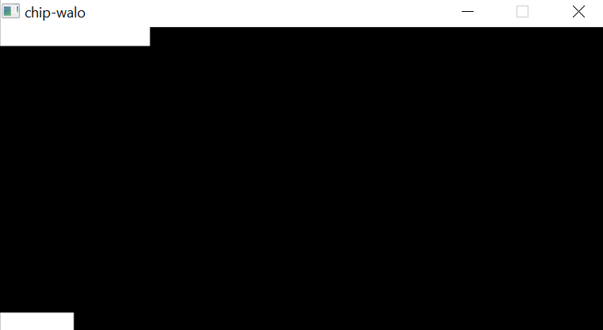
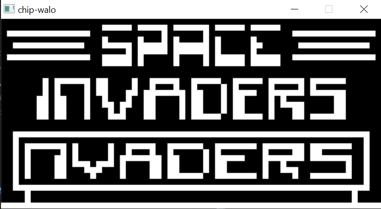

# chip-walo


## Table of Contents

- [chip-walo](#chip-walo)
  - [Table of Contents](#table-of-contents)
  - [Introduction](#introduction)
  - [Features](#features)
- [Game Sample](#game-sample)
- [Building](#building)
  - [Linux](#linux)
  - [Windows](#windows)
- [Usage](#usage)
  - [Run](#run)
  - [Input](#input)
- [Credits](#credits)
  - [Contribution](#contribution)

## Introduction

CHIP-8 is an interpreted programming language which was initially used in the late 1970s. 

It was made to allow more easily programed game for those computers. All programs written in CHIP-8 are run on a virtual machine which interprets each instruction.

Reference: [Wikipedia](https://en.wikipedia.org/wiki/CHIP-8)

> The *walo* is the tagalog of number 8.

## Features

- Working sound
- Cross-platform

# Game Sample

**Space Invaders**


# Building

## Linux

Required:
- gcc
- make
- libsdl2-dev

Download the repo:

```
git clone https://github.com/diamant3/chip-walo.git
``` 

build chip-walo:

```
cd chip-walo && make
```

## Windows

Required:

- [scoop](https://scoop.sh/)
- gcc
- make

SDL2 Installation using scoop:

```
scoop bucket add extras && scoop install sdl2
```

Download the repo:

```
git clone https://github.com/diamant3/chip-walo.git
``` 

build chip-walo:

```
cd chip-walo && make
```

 > [SDL2 Runtime Binaries](https://www.libsdl.org/download-2.0.php) is **REQUIRED**. Put it inside the ``` bin ``` folder.

# Usage

## Run

```
cd bin && chip-walo PATH/OF/THE/ROM
```

## Input

<table>
  <tr>
      <td>1</td>
      <td>2</td>
      <td>3</td>
      <td>4</td>
  </tr>
  <tr>
      <td>Q</td>
      <td>W</td>
      <td>E</td>
      <td>R</td>
  </tr>
  <tr>
      <td>A</td>
      <td>S</td>
      <td>D</td>
      <td>F</td>
  </tr>
  <tr>
      <td>Z</td>
      <td>X</td>
      <td>C</td>
      <td>V</td>
  </tr>
</table>

> This is the key mappings of the chip-walo, use keyboard to control.

# Credits

[SDL2](https://www.libsdl.org/) - graphics API that i used to make this.<br>
[scoop](https://scoop.sh/) - This is i used to fix the sdl2 dependencies.<br>
[Cowgod](http://devernay.free.fr/hacks/chip8/C8TECH10.HTM) - Heavily used for the references of op codes.<br>
[Wikipedia](https://en.wikipedia.org/wiki/CHIP-8) - Another reference for op codes.<br>
[Multigesture](https://multigesture.net/articles/how-to-write-an-emulator-chip-8-interpreter/) - the emulation of graphics of chip-8 is mostly from here.<br>
[Tobiasvl](https://tobiasvl.github.io/blog/write-a-chip-8-emulator/)- Clear explanation about chip-8 development.<br>
[Chip-8](https://chip-8.github.io/links/) - Chip-8 Resources.<br>
[Zophar.net](https://www.zophar.net/pdroms/chip8.html) - chip-8 ROMS.<br>

## Contribution

This is an educational project and feel free to contribute!
