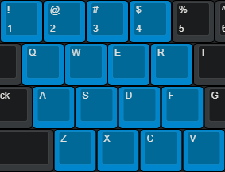

# chip-walo

## Introduction

CHIP-8 is an interpreted programming language which was initially used in the late 1970s.

It was made to allow more easily programed game for those computers. All programs written in CHIP-8 are run on a virtual machine which interprets each instruction.

Reference: [Wikipedia](https://en.wikipedia.org/wiki/CHIP-8)

> The word *walo* is tagalog of number 8

## Features

- Working sound
- Cross-platform

## Samples


## Building

Download the repo:

```bash
git clone https://github.com/diamant3/chip-walo.git
```

Requirements:

- CMake
- vcpkg
- SDL2

build chip-walo:

```bash
mkdir build
cd build
cmake ..
cmake --build .
```

> For Windows User, Type `vcpkg integrate install` and then build it using `-DCMAKE_TOOLCHAIN_FILE=C:\vcpkg\scripts\buildsystems\vcpkg.cmake` or path to the toolchain file of vcpkg.

## Usage

### Run

```bash
.\Debug\chip-walo "PATH OF THE ROM"
```

### Input

**CHIP-8 Keypad**


> Image source: [Tobiasvl](https://tobiasvl.github.io/blog/write-a-chip-8-emulator/)

**PC Keyboard**



> This is the key mappings of the chip-walo.

## Credits

- [SDL2](https://www.libsdl.org/)
- [xmake](https://xmake.io/#/)
- [Cowgod](http://devernay.free.fr/hacks/chip8/C8TECH10.HTM)
- [Wikipedia](https://en.wikipedia.org/wiki/CHIP-8)
- [Multigesture](https://multigesture.net/articles/how-to-write-an-emulator-chip-8-interpreter/)
- [Tobiasvl](https://tobiasvl.github.io/blog/write-a-chip-8-emulator/)
- [Chip-8](https://chip-8.github.io/links/)
- [Zophar.net](https://www.zophar.net/pdroms/chip8.html)
- [chip8-test-suite by Timendus](https://github.com/Timendus/chip8-test-suite)

## Contribution

This is an educational project and feel free to contribute!
